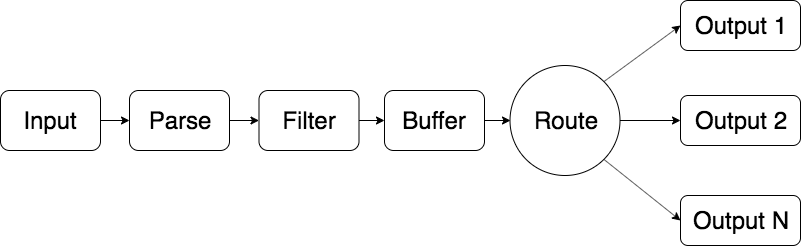

## Fluent Bit Log Pipeline Example

The goal of this example is to explain how the Fluent Bit log processing pipeline works with the ordering of configuration items in FireLens.



Above is a diagram of Fluent Bit's internal log processing pipeline. The ordering of staged is always enforced, regardless of the ordering of sections in the Fluent Bit configuration file. This is convenient for FireLens users.

As explained in the [Under the Hood: FireLens for Amazon ECS Tasks](todo) (todo: add link) blog post, FireLens generates a configuration file with the following ordering:

1. The log sources.
2. Transformer to add ECS Metadata.
3. Optional User provided configuration.
4. Log sinks derived from the Task Definition.

When you use Fluentd, this ordering matters. When you use Fluent Bit, this ordering does not matter at all. The ordering of the Fluent Bit log processing pipeline is constant.

In the [example task definition](task-definition-json), there are two application containers that use Fluent Bit & FireLens for logging. One of them logs to standard out, and uses a FireLens configured log output. The other, writes to a log file on a volume. This volume is mounted into the Fluent Bit container, and a custom config file contains configuration to tail the log file and then send it to a destination.

Note that in the FireLens generated config, the log file input will come after the filter which adds ECS Metadata. However, filters always come after inputs in Fluent Bit's log processing pipeline. Thus, the logs from the log file will have ECS Metadata added to them.

Furthermore, for the application which logs to standard out, there are two log destinations. One defined in the Task Definition, one defined in the optional config. In contrast, in Fluentd, logs are sent to the first output definition which accepts their tag. To send logs to multiple outputs, you must use the Fluentd `out_copy` plugin.

While this example has shown a small advantage of Fluent Bit over Fluentd, do not misinterpret its purpose. Fluentd is a great log collection and aggregation tool which has advantages and disadvantages when weighed against Fluent Bit.

### Explanation of Sections in the custom config FireLens

```
[INPUT]
    Name: tail
    Path: /var/log/file-app/app.log
    Tag: file-app-logs
```

A tail input which will read logs off of the volume.

```
[OUTPUT]
    Name firehose
    Match stdout-app*
    region us-west-2
    delivery_stream my-stream
```

An output which will match standard out logs from the container named `stdout-app`. With FireLens, if you specify the `awsfirelens` log driver for a container, its logs will be sent to Fluentd/Fluent Bit and the logs will have a tag whose prefix is the container name.

```
[OUTPUT]
    Name firehose
    Match file-app-logs*
    region us-west-2
    delivery_stream my-stream
```

An output for the logs from the tail input plugin.
